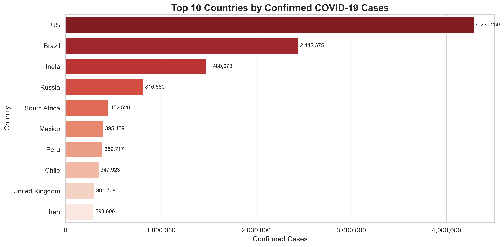
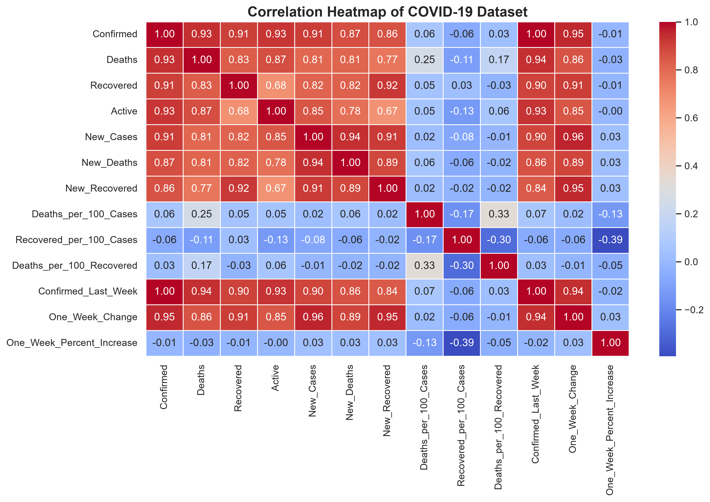
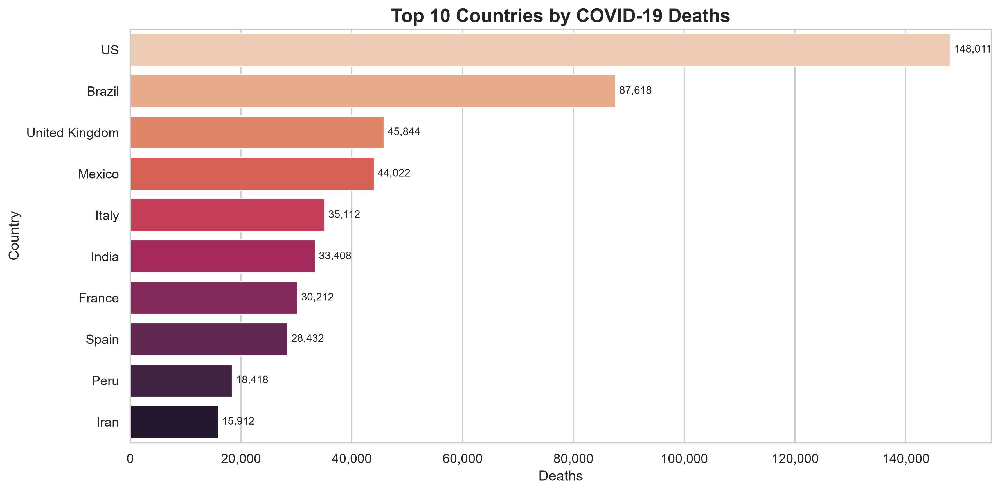
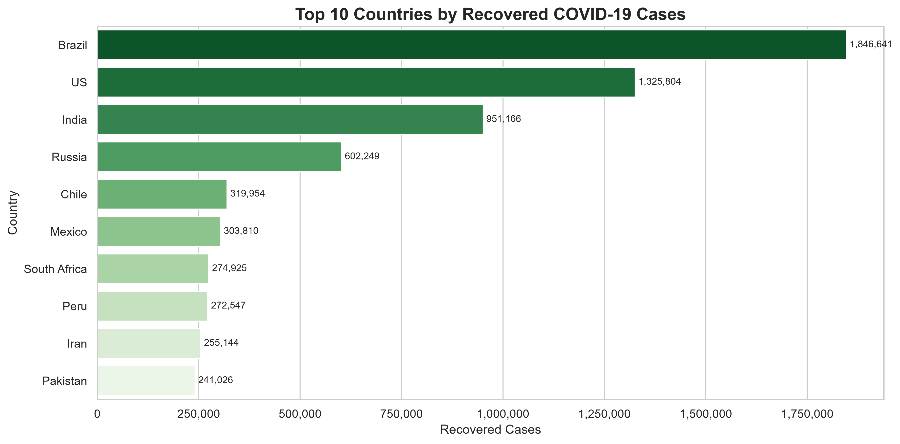

# 🦠 COVID-19 Data Analysis with Python

A complete **Exploratory Data Analysis (EDA)** project on the global COVID-19 dataset using **Python, Pandas, NumPy, Matplotlib, and Seaborn**.

This project demonstrates the complete data analysis workflow, from **data cleaning and preprocessing** to **visualization and extracting meaningful insights**.


---

## 📌 Project Overview

The objective of this project is to analyze the global COVID-19 dataset and identify trends, compare countries and WHO regions, and visualize important statistics through professional charts.

### The project includes:

- Data Cleaning
- Exploratory Data Analysis (EDA)
- Statistical Summary
- Correlation Analysis
- Data Visualization
- Key Findings and Conclusion

---

# 🎯 Objectives

- Clean and preprocess COVID-19 data
- Analyze confirmed, death, recovered, and active cases
- Compare countries with the highest COVID-19 impact
- Analyze WHO regions
- Understand relationships between numerical variables
- Visualize distributions and detect outliers

---

# 🛠️ Technologies Used

- Python
- Pandas
- NumPy
- Matplotlib
- Seaborn
- Jupyter Notebook

---

# 📂 Project Structure

```
covid19-analytics/
│
├── datasets/
│   ├── raw/
│   └── processed/
│
├── notebooks/
│   ├── 01_data_cleaning.ipynb
│   └── 02_exploratory_data_analysis.ipynb
│
├── images/
│   ├── top10_confirmed_cases.png
│   ├── top10_deaths.png
│   ├── top10_recovered.png
│   ├── who_region_confirmed.png
│   ├── correlation_heatmap.png
│   ├── histogram_confirmed.png
│   ├── boxplot_confirmed.png
│   └── pairplot.png
│
├── README.md
├── requirements.txt
└── .gitignore
```

---

# 📷 Sample Visualizations

## Top 10 Confirmed Cases



---

## Correlation Heatmap



---

## Top 10 Deaths



---

## Top 10 Recovered Cases



---

# 🔍 Key Findings

- The United States recorded the highest number of confirmed cases, deaths, and recoveries.
- The Americas reported the highest total confirmed COVID-19 cases among WHO regions.
- Most countries had relatively low confirmed case counts, while a few countries contributed a large share of global cases.
- Strong positive correlations exist between confirmed cases, deaths, and recoveries.
- Confirmed cases distribution is highly right-skewed with several significant outliers.

---

# 🚀 Installation

Clone the repository:

```bash
git clone https://github.com/BishalBh900/covid19-data-analysis-python.git
```

Navigate to the project folder:

```bash
cd covid19-data-analysis-python
```

Install required libraries:

```bash
pip install -r requirements.txt
```

---

# ▶️ How to Run

1. Open the project in VS Code or Jupyter Notebook.
2. Navigate to the `notebooks/` folder.
3. Run:

```
01_data_cleaning.ipynb
```

4. Run:

```
02_exploratory_data_analysis.ipynb
```

---

# 📈 Skills Demonstrated

- Data Cleaning
- Data Wrangling
- Exploratory Data Analysis (EDA)
- Statistical Analysis
- Data Visualization
- Correlation Analysis
- Python Programming
- Analytical Thinking

---

# 📚 Libraries Used

- pandas
- numpy
- matplotlib
- seaborn

---

# 👨‍💻 Author

**Bishal Bhandari**

- 🎓 BSc CSIT Student
- 🐍 Python Developer
- 📊 Data Analytics Enthusiast

---

⭐ If you found this project useful, consider giving it a star on GitHub!
